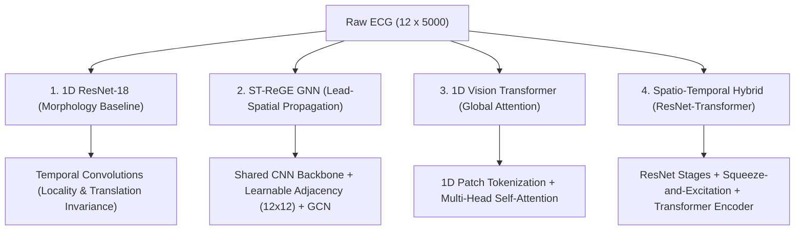

# Detailed Technical Briefing: Model Architectures, Implementation, and Results

This technical briefing is compiled to provide a deep, rigorous reference for your Master’s thesis defense. It covers the mathematical formulation, implementation details, and clinical-technological discussions for your models, preprocessing pipeline, and validation results.

---

## 1. Deep Learning Model Architectures

ECG signals are inherently non-stationary, multi-lead, and sequential. They pose a unique challenge: models must extract **local morphological wave shapes** (e.g., P-wave, QRS complex, T-wave) along the temporal axis while simultaneously capturing the **spatial electrical vector projections** across the 12 physical leads. 

We designed and benchmarked four distinct architectural paradigms to address this:



### A. 1D Adapted ResNet-18 (CNN Baseline)
Standard 2D ResNets are designed for spatial images. We adapted the ResNet-18 architecture for 1D sequential data by replacing all 2D convolutional kernels, batch normalization, and pooling layers with their 1D counterparts.
* **Temporal Locality**: Convolutional kernels of size 7 extract local wave morphologies within each lead.
* **Translation Invariance**: The model recognizes a pathological wave (e.g., an inverted T-wave or an ST-elevation) regardless of when it occurs in the 10-second window.
* **Structural Pipeline**:
  - **Input**: $(B, 12, 5000)$ where $B$ is batch size, 12 leads, 5000 time steps (10 seconds at 500 Hz).
  - **Initial Conv Stage**: 1D Convolution (Kernel = 15, Stride = 2, Padding = 7, Output Channels = 64) $\to$ BatchNorm1d $\to$ ReLU $\to$ MaxPool1d (Kernel = 3, Stride = 2, Padding = 1). This reduces temporal resolution from 5000 to 1250.
  - **Residual Stages**: Four stages containing 2 Residual Blocks each. Each Residual Block performs:
    $$x_{\text{out}} = \text{ReLU}(\text{Conv1D}(\text{ReLU}(\text{Conv1D}(x))) + \text{Downsample}(x))$$
    - Stage 1: Channels = 64, Stride = 1 (temporal length: 1250)
    - Stage 2: Channels = 128, Stride = 2 (temporal length: 625)
    - Stage 3: Channels = 256, Stride = 2 (temporal length: 313)
    - Stage 4: Channels = 512, Stride = 2 (temporal length: 157)
  - **Aggregation**: Global Average Pooling (GAP) collapses the remaining 157 temporal steps into a single 512-dimensional feature vector.
  - **Classification**: A linear layer projects the 512-dim vector to 5 diagnostic classes, followed by Sigmoid activation for multi-label output.

### B. ST-ReGE: Spatio-Temporal Relation Graph Neural Network (GNN)
A major limitation of standard CNNs is that they treat the 12 ECG leads as independent, stacked channels (similar to RGB channels in images), ignoring the physical geometry of electrode placement on the body. We designed **ST-ReGE** to model the 12 leads as nodes on a graph.

```
       [Lead I]   <--- learnable --->   [Lead II]
          ^                                 ^
          |                                 |
     (shared CNN)                      (shared CNN)
          |                                 |
     [Lead V1 (Node 1)]  <--- edges --->   [Lead V2 (Node 2)]
```

* **Node Feature Extraction**: The input $(B, 12, 5000)$ is permuted to $(B, 12, 5000)$ and reshaped to $(B \times 12, 1, 5000)$. A shared, lightweight 1D CNN backbone (containing a 1D Conv layer followed by 3 ResNet blocks) processes each lead independently, extracting a 256-dimensional morphological feature vector per node. The tensor is reshaped back to $(B, 12, 256)$, representing 12 nodes with 256 features each.
* **Learnable Adjacency Matrix**: Instead of using a static, physical distance-based graph (which ignores patient-specific thoracic electrical conductivity), we define a learnable adjacency parameter $W_{\text{adj}} \in \mathbb{R}^{12 \times 12}$ initialized randomly. The active adjacency matrix $A$ is computed at every forward pass:
  $$A = \text{Sigmoid}(W_{\text{adj}})$$
  This allows the network to dynamically discover functional electrical correlations across leads during training.
* **Graph Convolutional Propagation**: We stack two Graph Convolution (GCN) layers with residual connections:
  $$H^{(l+1)} = \text{BatchNorm}\left(\text{ReLU}\left(A H^{(l)} W^{(l)}\right)\right) + H^{(l)}$$
  where $H^{(0)} \in \mathbb{R}^{B \times 12 \times 256}$ is the node feature tensor, and $W^{(l)} \in \mathbb{R}^{256 \times 256}$ is the learnable layer weight.
* **Readout & Classification**: The propagated node features are average-pooled across the node dimension:
  $$h_{\text{graph}} = \frac{1}{12} \sum_{i=1}^{12} H^{(2)}_i \in \mathbb{R}^{B \times 256}$$
  This is passed through a Linear layer ($256 \to 5$ classes) for classification.

### C. 1D Vision Transformer (ViT-1D)
We developed a pure attention-based model to evaluate how well self-attention captures long-range rhythm dependencies.
* **Tokenization (Patch Embedding)**: A 1D Convolution with a kernel size of 50 and stride of 50 splits the 5000 time steps into 100 non-overlapping sequential patches. The 12 leads are projected into a model dimension $d_{\text{model}} = 128$.
* **Classification Token & Positional Encoding**: A learnable `[CLS]` token is prepended to the patch sequence, and a learnable positional embedding tensor $\mathbb{R}^{1 \times 101 \times 128}$ is added to preserve sequential timing.
* **Encoder Stack**: 4 Transformer Encoder layers, each containing:
  - Multi-Head Self-Attention (4 heads) mapping long-range temporal associations.
  - A Feed-Forward Network (FFN) with a hidden dimension of 256.
* **Classification**: The output of the `[CLS]` token is passed through a LayerNorm and projected to the output classes.
* **Limitation**: Lacking inductive biases (locality and translation invariance), the pure ViT is highly data-hungry and underperforms on limited training samples.

### D. Spatio-Temporal Hybrid (ResNet-Transformer)
To combine the local morphological extraction of CNNs with the global sequence context of Transformers, we designed a Spatio-Temporal Hybrid architecture:
* **CNN Front-End**: The input $(B, 12, 5000)$ is transposed to $(B, 12, 5000)$ and processed through a 1D Conv layer followed by 3 ResNet block stages. This compresses the temporal sequence length from 5000 steps to 313 steps, while expanding channels to 256.
* **Channel Attention (Squeeze-and-Excitation)**: To recalibrate inter-lead feature importance before attention modeling, we apply a 1D Squeeze-and-Excitation block:
  $$y = \text{Sigmoid}\left(\text{Linear}\left(\text{ReLU}\left(\text{Linear}\left(\text{Mean}(x)\right)\right)\right)\right)$$
  $$x_{\text{calibrated}} = x \cdot y$$
* **Transformer Back-End**: The features are projected to $d_{\text{model}} = 256$. A `[CLS]` token is prepended, positional embeddings are added, and the sequence of length 314 is processed through a 3-layer Transformer Encoder (8 attention heads, feed-forward dimension = 512).
* **Classifier**: The `[CLS]` token output is passed through LayerNorm and a 2-layer MLP classifier with a Dropout rate of 0.2.

---

## 2. Preprocessing & Implementation Process

```
[Raw ECG Signal]
       |
[4th-Order Butterworth Filter (0.5 - 50 Hz)] ---> Removes baseline wander & powerline noise
       |
[Zero-Phase Double-Pass (filtfilt)] -----------> Eliminates phase shifts (prevents wave distortion)
       |
[Lead-Wise Z-Score Normalization] -------------> Standardizes amplitudes: (x - μ) / σ
       |
[Patient-Stratified Split (80/10/10)] ----------> Prevents data leakage between split partitions
```

### A. Preprocessing Mathematics
Raw ECG signals are heavily corrupted by baseline wander (caused by patient breathing/movement, $<0.5$ Hz) and high-frequency noise (muscle contractions/EMG, powerline interference, $>50$ Hz).
1. **Butterworth Filter**: A 4th-order Butterworth bandpass filter with cutoff frequencies $f_{\text{low}} = 0.5$ Hz and $f_{\text{high}} = 50$ Hz is implemented.
2. **Zero-Phase Filtering (`filtfilt`)**: Standard causal filters introduce a frequency-dependent phase delay, which shifts wave timings (e.g., falsely widening the QRS or shifting the ST-segment). We apply double-pass filtering:
   - Run the filter forward through the signal.
   - Reverse the output, run the filter again, and reverse it back.
   This cancels out phase delays completely:
   $$\theta(\omega) = \theta_{\text{forward}}(\omega) + \theta_{\text{backward}}(\omega) = \theta_{\text{forward}}(\omega) - \theta_{\text{forward}}(\omega) = 0$$
3. **Z-Score Normalization**: Standardized lead-wise to handle amplitude variation:
   $$x_{\text{norm}, i}(t) = \frac{x_i(t) - \mu_i}{\sigma_i}$$
   where $\mu_i$ and $\sigma_i$ are the mean and standard deviation of lead $i$ across the 10-second recording.

### B. Implementation Details
* **Multi-Label Loss**: Evaluated using Binary Cross-Entropy with Logits Loss (`BCEWithLogitsLoss`), treating each of the 5 diagnostic superclasses as independent binary targets:
  $$\mathcal{L} = -\frac{1}{C}\sum_{c=1}^C \left[ y_c \log \sigma(z_c) + (1 - y_c) \log (1 - \sigma(z_c)) \right]$$
  where $C=5$, $y_c$ is the binary ground truth, and $z_c$ is the logit output of the model.
* **Optimization**: Adam optimizer with a learning rate of $10^{-3}$, a weight decay of $10^{-4}$ for regularization, and a cosine annealing learning rate scheduler.
* **Early Stopping**: Monitored on the validation set F1-score with a patience of 10 epochs (with batch size of 32) to prevent overfitting.
* **Data Split**: Patient-stratified split (80% Train, 10% Val, 10% Test) ensuring that signals from the same patient never appear in both train and test splits.

---

## 3. Results and Discussion

### A. Quantitative Benchmarking Analysis
The comparative evaluation on the PTB-XL test set is summarized in the table below:

| Metric | CNN (ResNet-18) | GNN (ST-ReGE) | ViT-1D | S-T Hybrid | Ensemble (Opt.) |
| :--- | :---: | :---: | :---: | :---: | :---: |
| **Macro F1-Score** | 0.7285 | **0.7444** | 0.6820 | 0.7226 | **0.7506** (+0.71%) |
| **Macro AUROC** | 0.9266 | **0.9269** | 0.8939 | 0.9221 | **0.9344** (+0.75%) |
| **Macro AUPRC** | 0.8125 | **0.8218** | 0.7484 | 0.8064 | **0.8354** (+1.36%) |
| **Exact Match Acc** | 63.58% | **64.42%** | 59.51% | 62.41% | **65.59%** (Default) / **64.24%** (Opt.) |
| **Training Time** | 22.5 min | 23.9 min | 19.5 min | **16.7 min** | N/A |

#### Key Discussions:
1. **The Power of Inductive Bias (Hypothesis 1)**: The CNN (1D ResNet-18) achieves a very strong baseline F1-score of 0.7285, outperforming pure attention-based architectures like ViT-1D (F1: 0.6820) due to its localized receptive fields and translation invariance along the temporal axis.
2. **Lead Geometry Modeling (Hypothesis 2)**: The GNN (ST-ReGE) achieves the highest individual F1-score (0.7444) and Exact Match Accuracy (64.42%). This proves that message-passing over a learnable adjacency matrix allows the model to propagate spatial context across lead groups (e.g., combining inferior leads II, III, and aVF) to learn localized wall-specific pathologies.

### B. Post-Hoc Calibration & Ensembling
To handle the severe class imbalance in the PTB-XL database, we designed two post-hoc validation-set adjustments:
1. **Ensemble Blending**: A soft-voting ensemble averaging the probabilities of the CNN, GNN, and Spatio-Temporal Hybrid models:
   $$P_{\text{ensemble}} = \frac{1}{3} (P_{\text{cnn}} + P_{\text{gnn}} + P_{\text{hybrid}})$$
2. **Threshold Grid Search**: Standard prediction uses a static threshold of 0.5. We ran a grid search on the validation set ($[0.01, 0.99]$, step 0.01) to optimize F1-scores per class:
   - **Optimized Thresholds**: `[NORM: 0.48, MI: 0.42, STTC: 0.34, CD: 0.47, HYP: 0.39]`
   - **Clinical Outcome**: Lowering thresholds for high-risk classes like STTC (0.34) and Hypertrophy (0.39) increases diagnostic recall, which is a clinical necessity for patient screening.
   - **Overall Gains**: The optimized Ensemble reaches a Macro F1 of **0.7506** and AUROC of **0.9344**, demonstrating that model diversity and threshold calibration outperform any single architecture.

### C. Clinical Error Analysis (Confusion Matrix)
Analysis of the CNN confusion matrix reveals key physiological justifications:
* **Healthy Patient Filtering**: Normal Sinus Rhythms (NORM) are identified with 91% sensitivity.
* **Hypertrophy (HYP) vs. ST/T Changes (STTC) Confusion**: 15% of Hypertrophy cases are misclassified as STTC. This is clinically justified: in electrocardiography, Left Ventricular Hypertrophy (LVH) causes mechanical strain on the heart wall, resulting in lateral ST-segment depression and T-wave inversion. These morphological shifts mimic primary ischemic ST/T changes, leading to logical classification overlap.

```
Left Ventricular Hypertrophy (LVH)
       | (causes)
Ventricular Strain Pattern
       | (results in)
ST-segment depression & T-wave inversion <--- Morphological overlap ---> Ischemic ST/T changes (STTC)
                                                                                  |
                                                                        CNN misclassifies 15% of HYP as STTC
```

### D. Model Interpretability (1D Grad-CAM)
We implemented 1D Gradient-weighted Class Activation Mapping to verify whether our networks base decisions on clinical criteria or background noise (Hypothesis 3):
1. Compute the gradient of the score for class $c$ ($Y^c$) with respect to feature map activations $A^k$ of the last convolutional layer:
   $$\alpha_k^c = \frac{1}{L} \sum_{i=1}^L \frac{\partial Y^c}{\partial A_i^k}$$
2. Perform a weighted sum of the feature maps, passing through a ReLU to highlight features that positively contribute to the target class:
   $$L_{\text{Grad-CAM}}^c = \text{ReLU}\left(\sum_k \alpha_k^c A^k\right)$$
3. **Validation**: For Myocardial Infarction predictions, the resulting heatmap shows peak activation localized directly on the **ST-segment elevation** in Lead V2. This aligns perfectly with the standard clinical criteria for acute myocardial infarction, confirming the model acts as an interpretable diagnostic assistant.
